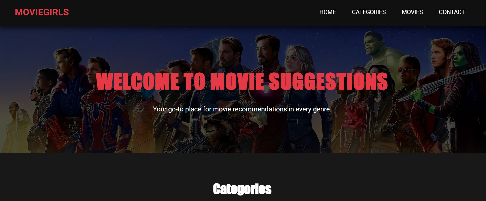

# 🎬 MovieGirls - Movie Suggestions Platform

A beautiful, responsive movie discovery website that helps users explore and find movies across various genres with an intuitive interface and stunning visual design.



## ✨ Features

- 🎭 **Multi-Genre Exploration**: Browse movies across Action, Drama, Horror, Animation, and Science Fiction
- 🎨 **Modern Dark Theme**: Sleek dark UI with vibrant accent colors
- 📱 **Fully Responsive**: Optimized for desktop, tablet, and mobile devices
- 🔍 **Interactive Navigation**: Smooth scrolling and intuitive category browsing
- 📞 **Contact Integration**: Built-in contact form for movie suggestions
- ⚡ **Fast Performance**: Optimized images and smooth animations
- 🎯 **User-Friendly**: Clean layout with easy-to-navigate interface

## 🚀 Live Demo

[**Experience MovieGirls Live**](https://zahirak.github.io/movies-suggestions/)

## 🎥 Genre Categories

- **Action** - Thrilling action-packed adventures
- **Drama** - Emotional and heartwarming stories  
- **Horror** - Spine-chilling horror experiences
- **Animation** - Family-friendly animated features
- **Science Fiction** - Futuristic and space adventures

## 🛠️ Technologies Used

- **Frontend**: HTML5, CSS3, JavaScript
- **Styling**: Custom CSS with CSS Grid and Flexbox
- **Fonts**: Roboto for body text, Impact for headings
- **Design**: Dark theme with gradient accents and smooth transitions
- **Icons**: Custom styling with hover effects
- **Layout**: Responsive grid systems

## 📁 Project Structure

```
movies-suggestions/
│
├── categories/
│   └── images/
│       ├── Action/          # Action movie posters
│       ├── animation/       # Animation movie posters
│       ├── drama/           # Drama movie posters
│       ├── horror/          # Horror movie posters
│       ├── science-fiction/ # Sci-Fi movie posters
│       └── icons/           # UI icons and elements
│
├── images/                  # Website background and UI images
│   ├── actionhome.jpg
│   ├── animationhome.jpg
│   ├── backroundhome.jpg
│   ├── contactbackround.jpg
│   ├── dramahome.jpg
│   ├── horrorhome.jpg
│   ├── sciencefictionhome.jpg
│   └── screenshot.png
│
├── contact.css              # Contact page styles
├── contact.html             # Contact form page
├── home.css                 # Home page styles
├── index.html               # Main homepage
├── movies.css               # Movies gallery styles
└── movies.html              # Movies browsing page
```

## 🎮 How to Use

### For Viewers:
1. **Browse Categories**: Click on genre boxes on the homepage to explore movies
2. **View Movie Gallery**: Browse through curated movie collections in each genre
3. **Get Details**: Click on movie posters for more information (individual movie pages)
4. **Suggest Movies**: Use the contact form to recommend new films

### Navigation:
- **Home**: Landing page with genre overview
- **Categories**: Direct access to movie genres
- **Movies**: Complete movie gallery across all genres
- **Contact**: Form to submit movie suggestions and feedback

## 💻 Local Development

### Prerequisites
- Modern web browser (Chrome, Firefox, Safari, Edge)
- Basic understanding of HTML/CSS (for customization)

### Installation

1. **Clone the repository**
   ```bash
   git clone https://github.com/ZahiraK/movies-suggestions.git
   cd movies-suggestions
   ```

2. **Run the application**
   ```bash
   # Open directly in browser
   open index.html
   
   # Or use a local server for better performance
   python -m http.server 8000
   # Then visit http://localhost:8000
   ```

## 🎨 Customization

### Adding New Movies
Edit the movie galleries in `movies.html`:
```html
<div class="gallery">
    <a href="categories/your-movie.html">
        
        <div class="image-text">Your Movie Title</div>
    </a>
    <!-- Add more movies... -->
</div>
```

### Styling Modifications
Customize colors and themes in CSS files:
- **Primary Colors**: Modify `#E63946` (red accent) and `#121212` (dark background)
- **Gradients**: Update gradient colors in `.category h2` and category boxes
- **Fonts**: Change font families in `font-family` declarations

### Adding New Genres
1. Add new category section in `index.html` and `movies.html`
2. Create corresponding CSS styles
3. Add genre-specific images to appropriate folders

## 🌐 Browser Compatibility

- ✅ Chrome 60+
- ✅ Firefox 55+
- ✅ Safari 12+
- ✅ Edge 79+

## 📱 Responsive Design

The website adapts seamlessly to:
- **Desktop**: Full grid layouts with hover effects
- **Tablet**: Adjusted grid columns (2-column layout)
- **Mobile**: Single column layout with optimized touch targets

## 🔧 Development Features

- **Smooth Scrolling**: Enhanced navigation experience
- **Hover Animations**: Interactive element feedback
- **Back to Top Button**: Easy navigation on long pages
- **Sticky Header**: Persistent navigation access
- **Form Validation**: Contact form with required fields

## 🤝 Contributing

We welcome contributions to enhance MovieGirls! Here's how you can help:

1. **Fork the repository**
2. **Create a feature branch**
   ```bash
   git checkout -b feature/amazing-feature
   ```
3. **Commit your changes**
   ```bash
   git commit -m 'Add amazing feature'
   ```
4. **Push to the branch**
   ```bash
   git push origin feature/amazing-feature
   ```
5. **Open a Pull Request**

### Areas for Contribution
- Add more movie data and posters
- Implement search and filter functionality
- Enhance mobile user experience
- Add movie rating systems
- Improve accessibility features
- Add dark/light theme toggle

## 🐛 Issue Reporting

Found a bug or have a feature request? [Open an issue](https://github.com/ZahiraK/movies-suggestions/issues) with detailed information.

## 📝 License

This project is open source and available under the [MIT License](LICENSE).

## 👩‍💻 Author

**ZahiraK**
- GitHub: [@ZahiraK](https://github.com/ZahiraK)
- Project: [Movie Suggestions](https://github.com/ZahiraK/movies-suggestions)

## 🙏 Acknowledgments

- **Movie Enthusiasts**: For the inspiration to create this platform
- **Web Design Community**: For modern UI/UX inspiration
- **Google Fonts**: Providing beautiful typography
- **Open Source Tools**: Making web development accessible

## 📞 Support

Need help with the project?
1. Check existing [Issues](https://github.com/ZahiraK/movies-suggestions/issues)
2. Create a new issue with detailed description
3. Provide steps to reproduce if reporting a bug

## 🔄 Future Enhancements

Planned features for upcoming versions:
- Movie search functionality
- User rating and review system
- Movie trailer integrations
- Personalized recommendations
- Social sharing features
- Advanced filtering options

---

**🎬 Happy movie exploring with MovieGirls!**
